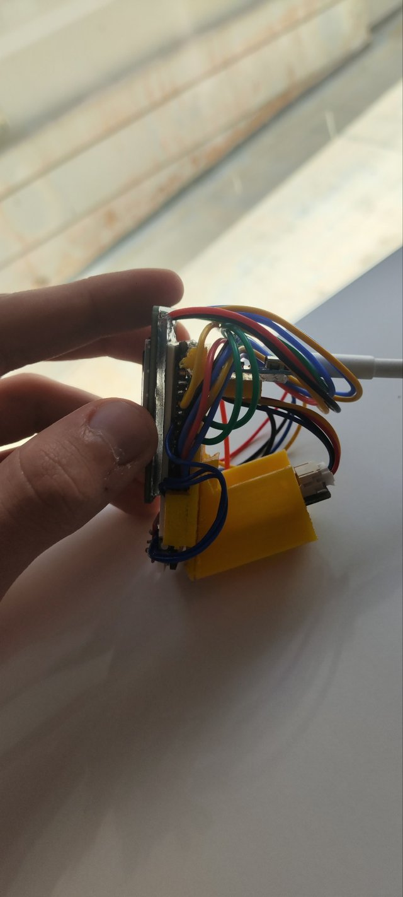
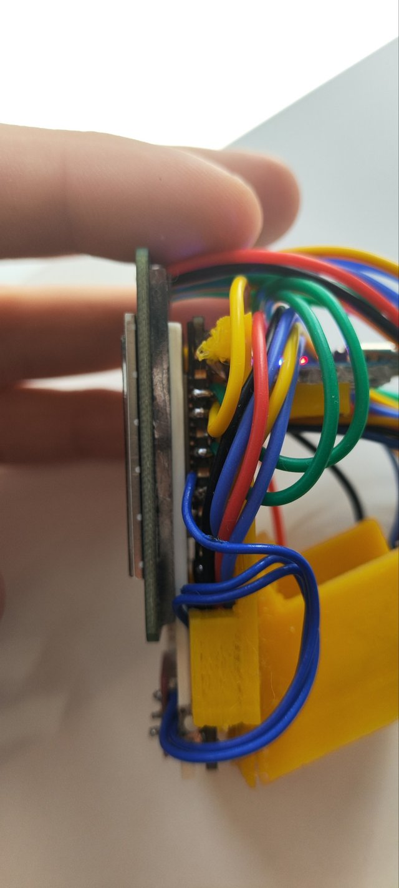

# ESP32 FireBeetle Weather Station

A small, compact desk weather station built around a DFRobot FireBeetle ESP32-E. Press the button and the screen shows the current temperature and humidity, then switches itself off again after 5 seconds.

  
  

The goal was a device about the size of a commercial pocket sensor, built only from parts that are easy to buy in bulk, so anyone can reproduce it. In the end it came out smaller than a graphical calculator.

## Parts

| Part | Role |
|---|---|
| DFRobot FireBeetle ESP32-E V1.0 | Main board |
| BME280 sensor | Temperature, humidity and pressure (I2C) |
| 1.54" 240×240 LCD module | Display (SPI) |
| Push button | Wakes the screen |
| 3D-printed case and stand | Holds everything together (STL files in [`stl`](stl)) |

The BME280 also measures pressure, but the current screen shows temperature and humidity.

## How it works

1. On start-up the program sets up the libraries and checks that the sensor is present. If it is not found, it stops.
2. The sensor, button and screen are initialised.
3. The main loop waits for a button press. On a press it reads the sensor, draws the screen and shows it for 5 seconds, then turns the screen off.

The firmware is written in C++ in the Arduino IDE, using the Adafruit libraries for the sensor and display. The screen is 240×240 pixels and the interface is drawn by hand from lines, rectangles and circles.

> The original firmware was lost with an old laptop. Only the interface code survived as a backup, so the full source is not in this repository.

## Design notes

- **Heat:** the ESP32 gives off heat, which can throw off temperature readings. The sensor sits in its own holder on the stand, away from the board, and the 3D-printed standoff acts as an insulating layer between them.
- **Passive cooling:** the board is fixed with double-sided tape, which also slows heat transfer to the case. The board settles at a steady temperature and does not disturb the sensor, so no fan is needed.
- **Stand:** a printed stand with a triangular insert that latches into a triangular hole.
- **Wiring:** the screen is connected with the supplied wires instead of its JST connector, which keeps the wiring short and easy to fix.
- **Iterations:** the case went through several versions, from a holder for just the board, to a stand, to a screen-and-sensor holder, to a final version fixing tolerances.

The models were designed in Tinkercad and sliced in PrusaSlicer.

## Files

3D-printable models (STL) in the [`stl`](stl) folder:

- `esp-holder-with-a-stand-for-charger.stl`
- `just-the-stand.stl`
- `just-the-stand-fixed.stl`
- `just-the-standoffs.stl`
- `Copy-of-Copy-of-Tremendous-Kasi.stl`

## Lessons learned

- Check the exact sensor you ordered: the first batch labelled BME280 were actually BMP280, which has no humidity sensor.
- Print tolerances matter, so measure the holes more than once.
- Keep the code in Git. It would have saved the original firmware.

## License

No license is granted. All rights reserved. If you would like to use or build on this, please open an issue and ask.

Made by Plaui.
